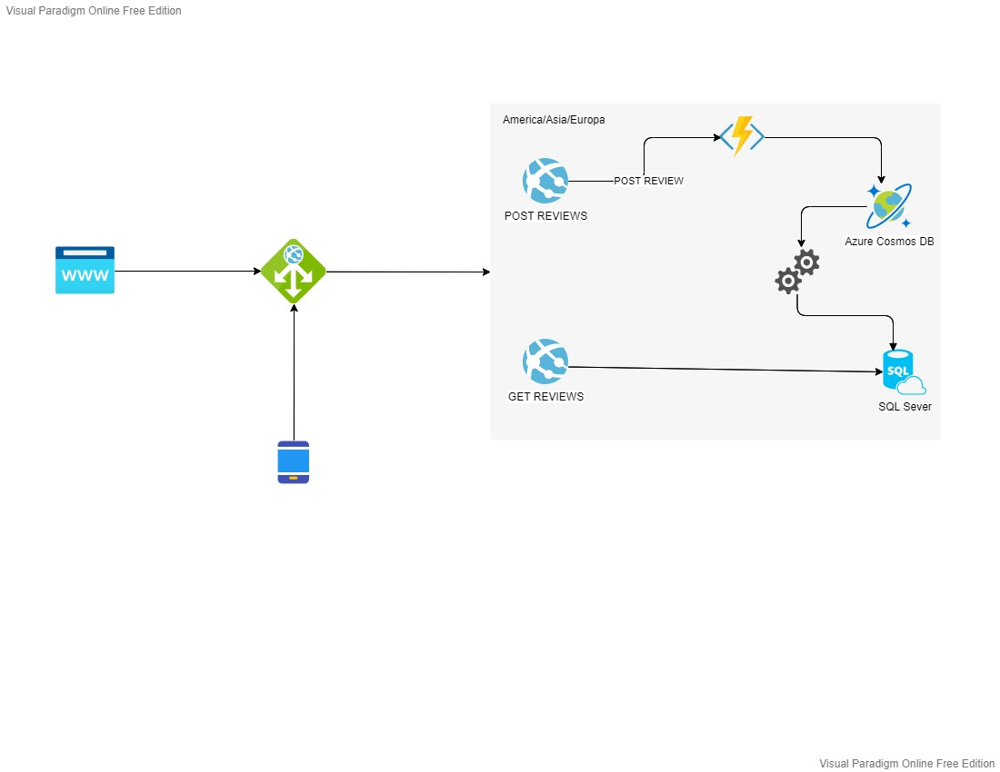

# Random Camera Review high level system design
---
## Problem to resolve
The company "RandomCameraReviews" needs a system that allows professional photographers to upload "reviews" of cameras, so that anyone from anywhere in the world can search for reviews and buy them through their portal.
The company has a team of developers specialized in frontend that will create a portal for editors to upload "reviews" and users can see them, and they have requested that you, as a Backend specialist, provide them with a system, including an API that allows the next:

* Upload reviews of Cameras
* Obtain the content of the reviews to show it in portal views in its web and mobile versions.
* User management for publishers (does not include visitors reading reviews)

It is also known that the company "RandomCameraReviews" plans to distribute mostly in South America where their biggest market is, but they also have sales in North America, Europe, and very few in Asia.

### Scope

#### Uses Case
* As an editor I would like to upload a review of a camera
* As an editor I would like to upload a review of a camera lens
* As an editor I would like to edit my previous reviews
* As an editor I would like to get a report of my reviews per month
* As an editor I would like to upload reviews of camera parts
* As an editor I would like to comment in other reviews
* As a manager I would like to add new reviewers
* As a manager I would like to deactivate reviewers

#### Out of Scope
* As an unregistered user I would like to upload a review of a camera
* As an unregistered user I would like to sign up in the system
* As an unregistered user I would like to comment in a review

---
## Arquitectura

### Diagramas

### Modelo de datos
Poner diseño de entidades, Jsons, tablas, diagramas entidad relación, etc..

---
## Limitaciones
Lista de limitaciones conocidas. Puede ser en formato de lista.
Ej.
* Llamadas del API tienen latencia X
* No se soporta mas de X llamadas por segundo
---
## Costo
Descripción/Análisis de costos
Ejemplo:
"Considerando N usuarios diarios, M llamadas a X servicio/baseDatos/etc"
* 1000 llamadas diarias a serverless functions. $XX.XX
* 1000 read/write units diarias a X Database on-demand. $XX.XX
Total: $xx.xx (al mes/dia/año)